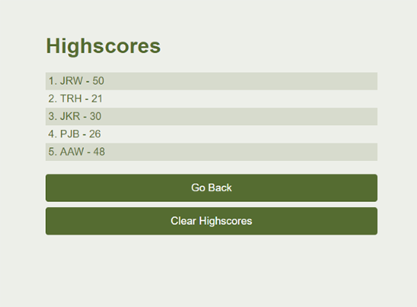

# 06-code-quiz
A timed quiz on JavaScript fundamentals.

## Description
	
JavaScript code has been used to create an interactive multiple-choice Quiz.     
The player must compete against the clock to get the fastest time with the fewest errors.   
A wrong answer will cost them 10 seconds...!   

The **Code Quiz** has been optimised for various display sizes using responsive CSS design.  
 

	
## Installation
	
The page is live at https://forestdean.github.io/06-code-quiz/
	
## Usage
	   
* Click `Start Quiz` to initiate the Quiz.
* Answer the question by clicking one of the four choices.
* You will receive **Correct/Wrong** feedback and the quiz will progress...
* Answer all 5 questions within **60 seconds**.
* A **Wrong** answer will deduct **10 seconds** off your scoring time.
* If you time-out ...your score is **O**.
* Enter your initials and `Submit` to log your score.
* `Go Back` if you want to try again...!
	
## Credits
	
HTMLAudioElement: Audio() - https://developer.mozilla.org/en-US/docs/Web/API/HTMLAudioElement/Audio     
How to Store a Javascript Array in localStorage - https://catalins.tech/store-array-in-localstorage/

## License
	
**MIT** - Please refer to the LICENSE in the repository.